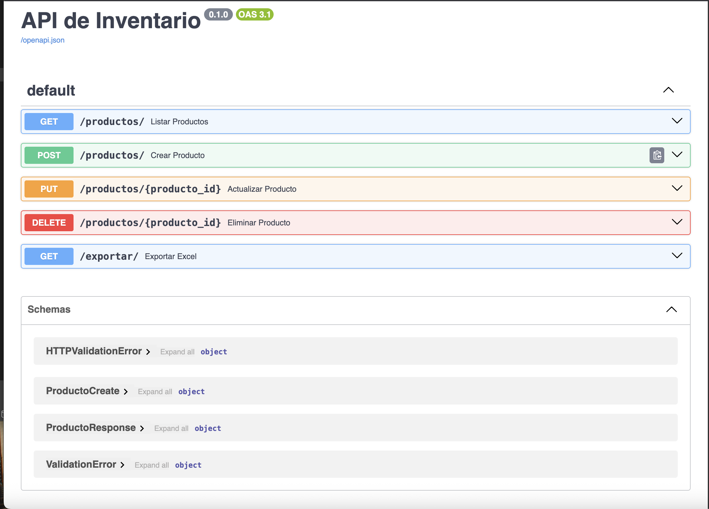
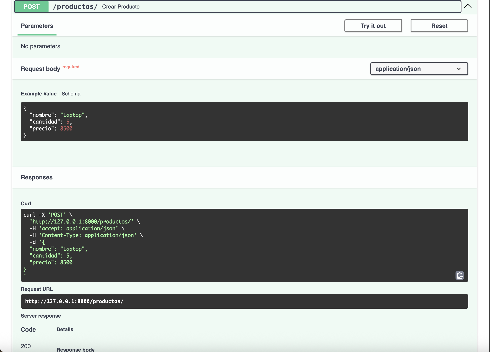
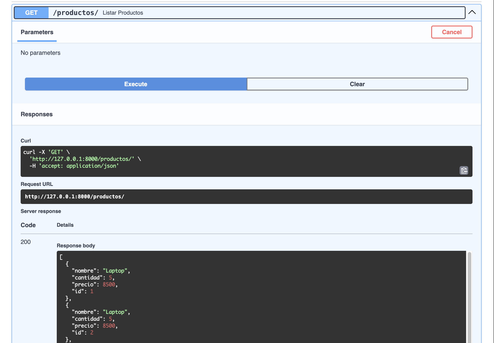
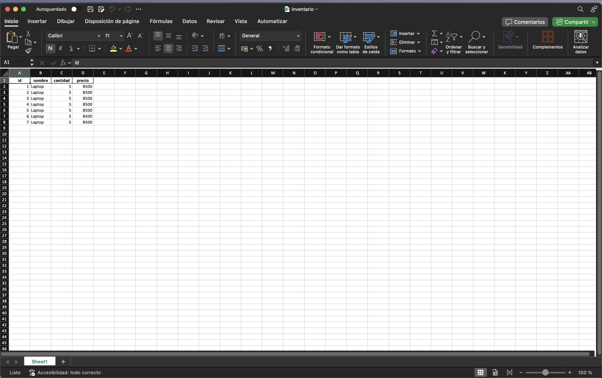

# 📦 API de Inventario con FastAPI

API RESTful profesional para la gestión de inventario, desarrollada con **FastAPI** y **SQLAlchemy**. Permite crear, listar, actualizar y eliminar productos, así como exportar el inventario a Excel. Ideal para portafolios de desarrolladores Back-end Python.

---

## 🚀 Funcionalidades
- **CRUD de productos** (Crear, Leer, Actualizar, Eliminar)
- **Exportación de inventario a Excel** (`inventario.xlsx`)
- **Documentación automática** con Swagger UI y Redoc
- **Validación de datos** con Pydantic
- Base de datos **SQLite** (fácilmente adaptable a PostgreSQL/MySQL)

---

## 🛠️ Tecnologías usadas
- [FastAPI](https://fastapi.tiangolo.com/)
- [Uvicorn](https://www.uvicorn.org/)
- [SQLAlchemy](https://www.sqlalchemy.org/)
- [Pandas](https://pandas.pydata.org/)
- [OpenPyXL](https://openpyxl.readthedocs.io/)

---

## 📦 Instalación y uso rápido

1. **Clona el repositorio:**
	```bash
	git clone <url-del-repo>
	cd inventario_api
	```
2. **Crea un entorno virtual (opcional pero recomendado):**
	```bash
	python3 -m venv venv
	source venv/bin/activate
	```
3. **Instala las dependencias:**
	```bash
	pip install -r requirements.txt
	```
4. **Inicia el servidor:**
	```bash
	uvicorn main:app --reload
	```
5. **Accede a la documentación interactiva:**
	- Swagger UI: [http://localhost:8000/docs](http://localhost:8000/docs)
	- Redoc: [http://localhost:8000/redoc](http://localhost:8000/redoc)

---

## 🧑‍� Ejemplos de uso de la API

### Crear producto
```http
POST /productos/
Content-Type: application/json
{
  "nombre": "Laptop HP",
  "cantidad": 10,
  "precio": 999.99
}
```

### Listar productos
```http
GET /productos/
```

### Actualizar producto
```http
PUT /productos/1
Content-Type: application/json
{
  "nombre": "Laptop Lenovo",
  "cantidad": 5,
  "precio": 799.99
}
```

### Eliminar producto
```http
DELETE /productos/1
```

### Exportar inventario a Excel
```http
GET /exportar/
```

---

## �📂 Estructura del proyecto

```
inventario_api/
│── main.py           # Rutas principales de la API
│── database.py       # Configuración de la base de datos y modelo ORM
│── models.py         # Modelos Pydantic (validación y serialización)
│── inventario.db     # Base de datos SQLite
│── requirements.txt  # Dependencias
│── README.md         # Documentación del proyecto
│── screenshots/      # Capturas de pantalla
```

---

## 📸 Capturas

### Swagger UI


### Crear producto


### Listar productos


### Exportación a Excel


---

## 📝 Recomendaciones profesionales
- Usa un entorno virtual para aislar dependencias.
- Cambia la base de datos a PostgreSQL/MySQL para producción.
- Agrega autenticación y autorización para mayor seguridad.
- Implementa tests automáticos para robustez.
- Usa variables de entorno para credenciales y configuración.

---

Desarrollado por [Tu Nombre].
